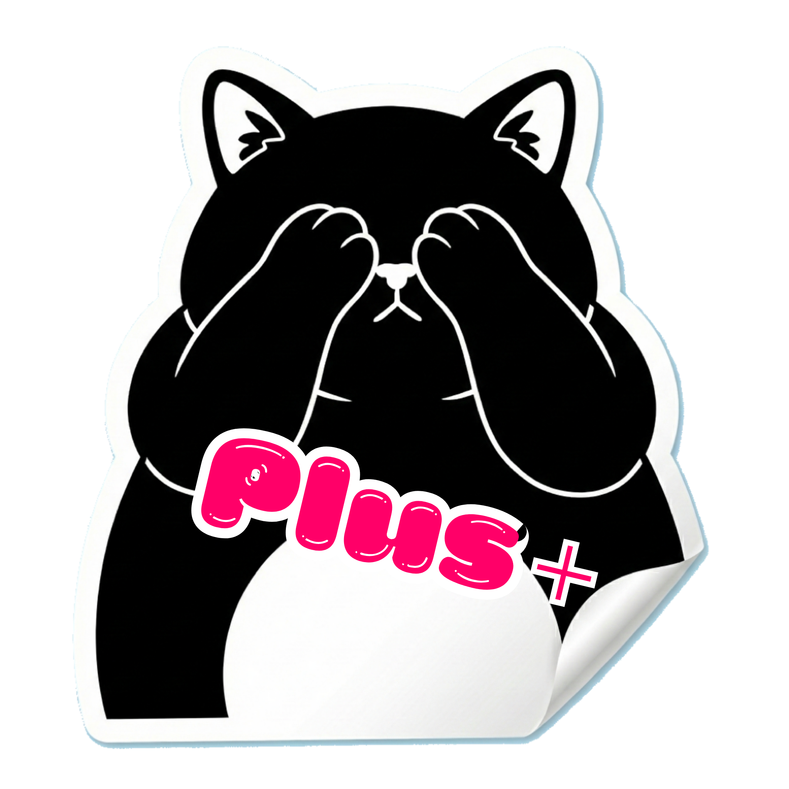
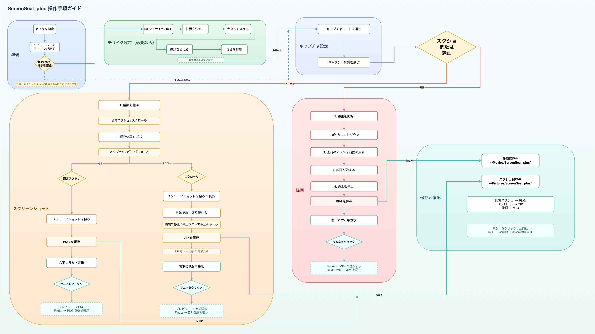

# ScreenSeal_plus

画面上の機密情報をモザイクで隠すための macOS メニューバーアプリ。

画面収録やスクリーンショット撮影時に、ScreenSeal_plus のモザイクウィンドウを配置することで、パスワードや個人情報などを安全に隠せます。モザイクウィンドウ自体はスクリーンショットや画面共有に映らず、モザイク効果のみが反映されます。

## Features

- **リアルタイムモザイク** - 背面の画面内容をリアルタイムにキャプチャしてモザイク処理
- **3種類のフィルター** - ピクセル化 / ガウスぼかし / クリスタライズ
- **強度調整** - 右クリックメニューのスライダーまたはスクロールホイールで調整
- **複数ウィンドウ** - 同時に複数のモザイク領域を配置可能
- **メニューバー管理** - ウィンドウの一覧表示、表示/非表示の切り替え
- **マルチディスプレイ対応** - 複数モニタ環境でも動作
- **レイアウトプリセット** - ウィンドウ配置を保存して一発で呼び出し（複数登録可能）
- **設定の永続化** - モザイクタイプと強度はアプリ終了後も保持
- **静止画スクリーンショット** - メニューバーからモザイク入りPNGを1枚保存
- **スクロールキャプチャ** - ウィンドウや選択範囲を自動スクロールし、結果を ZIP 1つに保存
- **画面録画** - メニューバーから単一ディスプレイを MP4 録画
- **保存後サムネイル確認** - スクショや録画の保存後に、画面上へサムネイルを一時表示
- **開き先の選択** - スクショは Finder / Preview、録画は Finder / QuickTime を選択可能
- **英語 / 日本語切り替え** - アプリ内メニューと主要な文言をその場で切り替え可能
- **スクショ保存倍率の選択** - `original` / `2x` / `1x` / `0.5x` で保存倍率を選べる
- **クリックズーム** - 左クリック中はカーソル中心へ滑らかに拡大（1.8x）

## Requirements

- macOS 14.0 以降
- Screen Recording 権限（初回起動時にシステムダイアログが表示されます）
- 録画機能は macOS 15.0 以降で利用可能

## Installation

[Releases](https://github.com/nyanko3141592/ScreenSeal/releases) ページから最新の `ScreenSeal_plus-macOS.zip` をダウンロードして解凍し、`ScreenSeal_plus.app` を Applications フォルダに移動してください。

## Usage



1. アプリを起動するとメニューバーにアイコンが表示されます
2. 必要なら **Language** で **English** / **日本語** を切り替えます
3. メニューから **New Mosaic Window** をクリックしてモザイクウィンドウを作成
4. ウィンドウをドラッグして隠したい箇所に配置、端をドラッグしてリサイズ
5. **右クリック**でコンテキストメニューを開き、フィルタータイプや強度を変更
6. **スクロールホイール**でも強度を素早く調整可能
7. メニューバーからウィンドウの表示/非表示を切り替え
8. **Capture Mode** で **Record** または **Screenshot** を選びます
9. **Capture Target** で **Full Display** / **Window** / **Select Region...** を選びます
10. **Screenshot** モードでは **Screenshot Type** で **Single Screenshot** または **Scroll Capture** を選びます
11. **Screenshot Scale** で `original` / `2x` / `1x` / `0.5x` を選びます
12. **Single Screenshot** では **Take Screenshot** で `~/Pictures/ScreenSeal_plus/` に PNG 保存
13. **Scroll Capture** では **Window** か **Region** を選んで **Take Screenshot** で開始し、終わりたい所で **Stop Scroll Capture** を押します
14. スクロールキャプチャは `~/Pictures/ScreenSeal_plus/` に ZIP を1つ保存します。中には `step_*.png` と `stitched.png` が入ります
15. **Screenshot Click Action** は保存後サムネイルをクリックした時に効きます
16. `Preview` は通常スクショの PNG、またはスクロールキャプチャの `stitched.png` を開きます
17. `Finder` は通常スクショの PNG、またはスクロールキャプチャの ZIP を表示します
18. **Record** モードでは **Start Recording** で `~/Movies/ScreenSeal_plus/` に MP4 保存
19. **Recording Click Action** で録画の開き先を **Finder** / **QuickTime** から選びます
20. 保存後は画面上にサムネイルが出て、クリックすると選んだアプリで開きます
21. 録画開始前は3秒カウントダウンが出て、その後は直前に使っていたアプリが前面に戻るので、すぐ操作できます
22. 録画中に左クリックを押すとクリックズームが有効化

## Build

```bash
xcodebuild -project ScreenSeal.xcodeproj -scheme ScreenSeal -configuration Release -derivedDataPath build build
ditto -c -k --sequesterRsrc --keepParent build/Build/Products/Release/ScreenSeal_plus.app ScreenSeal_plus-macOS.zip
```

## Tech Stack

- Swift / SwiftUI / AppKit
- ScreenCaptureKit (画面キャプチャ)
- Core Image (モザイクフィルター処理)
- Metal (GPU アクセラレーション)

## License

MIT

## 元の作者

- X のポスト: [https://x.com/nya3_neko2/status/2022893455069057329?s=20](https://x.com/nya3_neko2/status/2022893455069057329?s=20)
- GitHub リポジトリ: [https://github.com/nyanko3141592/ScreenSeal.git](https://github.com/nyanko3141592/ScreenSeal.git)
